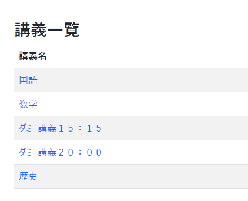
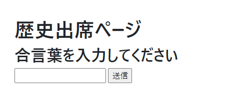
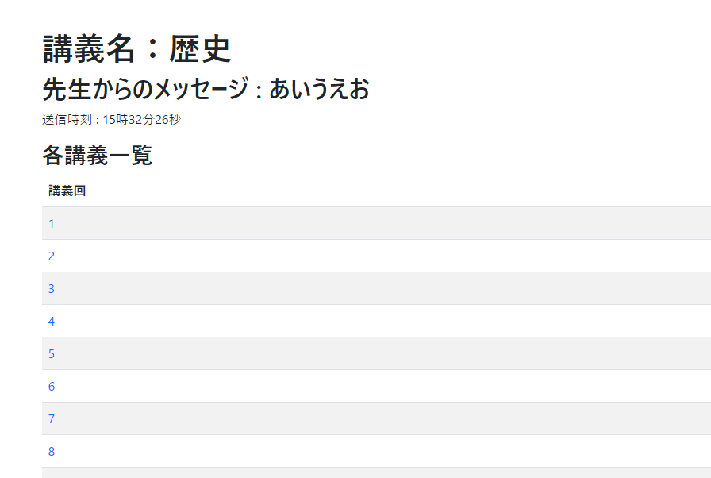
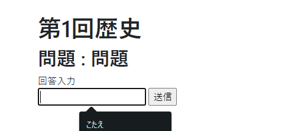
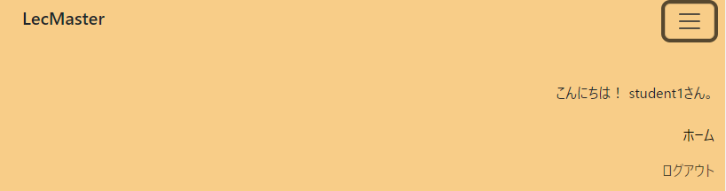

# 生徒用マニュアル

1.  注意書き
本アプリケーションのご利用にあたり、ブラウザの「戻る」ボタンは使用しないでください。予期せぬ動作をする場合があります。
 
1.  講義の選択
生徒用のアカウントでログインすることにより講義一覧を表示することができます。
受講する講義を選択しましょう。
 

 
1.  出席方法
講義選択後に、出席するための合言葉を入力するフォームが表示されます。
該当する`合言葉`を入力することで講義の詳細ページにすすめます。

 
1.  講義回の選択
各講義一覧の番号をクリックすると、その講義回の詳細ページが表示されます。受講する講義回を確認して選択しましょう。 
 

 
1.  問題の回答
講義回の詳細ページでは、先生から出題された問題が表示されます。
こちらで回答を入力・送信することにより、記録されます。
 

 
1.  ログアウト
利用終了時に、右上のハンバーガーボタン→ログアウトより、ログアウトができます。
 

[戻る](USER.md)　｜　[トップへ](../README.md)
