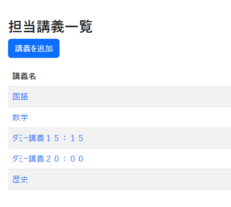
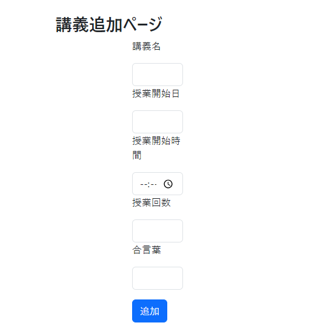
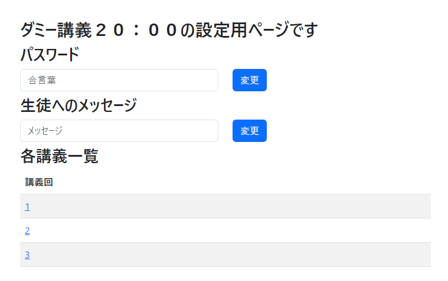
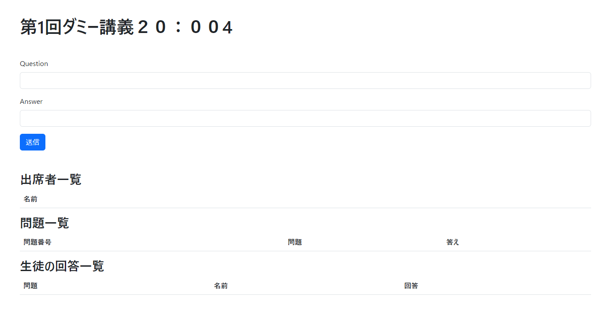

# 先生用マニュアル

> [!WARNING]
> こちらは先生用のマニュアルになります。生徒のユーザーは[こちら](STUDENT.md)。

先生用のユーザーIDでログインをすると、講義の一覧を見ることができます。
 

`講義を追加`ボタンを押すことにより、講義を追加するためのフォームを表示させることができます。
 

 
各項目を埋めていき、`追加`ボタンをクリックすることにより、講義を追加することができます。

また、講義を一覧することができるページにて、各講義名をクリックすると、各講義に関する設定をすることができます。
 

 
そして、各講義一覧に記されている各講義回の番号を選択すると、各講義回の設定画面に遷移することができます。
 

 
Questionの中に問題文を入れ、Answer内にその問題の答えを入れ、送信をすることにより、生徒に問題を送信することができます。

送信した問題は問題一覧から閲覧することができます。また、同時に生徒の回答状況も把握することができます。

また、設定された講義時間に生徒が出席した場合は、下の出席者一覧に生徒名が表示されます。

[戻る](USER.md)　｜　[トップへ](../README.md)
